# VAE for celebA, MNIST dataset
Training Variational Autoencoder using celebA and MNIST dataset.

To train celebA dataset, download [imgimg_align_celeba.zip](https://drive.google.com/drive/folders/0B7EVK8r0v71pTUZsaXdaSnZBZzg?resourcekey=0-rJlzl934LzC-Xp28GeIBzQ) and [list_eval_partition.txt](https://drive.google.com/drive/folders/0B7EVK8r0v71pdjI3dmwtNm5jRkE?resourcekey=0-TD_RXHhlG6LPvwHReuw6IA), unzip, place it under [`data/celebA/`](data/celebA).
For training, you can modify hyperparameters e.g. *learning rate, latent-dim, batch size, lr decay schedule...*
(Take a look at [`parser_utils.py`](parser_utils.py)).
Learning curve will be saved at "{model}_{dataset}.csv" by default (in this case e.g. [`cnn_celebA.csv`](cnn_celebA.csv)).
While training, reconstruction results for the test dataset are saved in `results/{dataset}/{model}` direcotry, (e.g. [`results/celebA/cnn`](results/celebA/cnn)).
Pretrained model is provided in "{model}_{dataset}.pt" format (e.g. [`cnn_celebA.pt`](cnn_celebA.pt)).

## celebA Dataset

### Training with CNN-based Model
`
python train.py --model cnn --dataset celebA --num-epochs 300 --latent-dim 128
`

### Reconstruction examples
Original image on the top, reconstruction on the bottom.

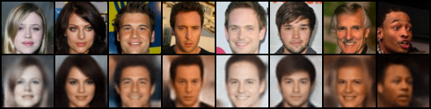

### Generate Samples
Generation (decode) from random Gaussian distribution.
`python generate_samples.py --model cnn --dataset celebA --saved-path cnn_celebA.pt --latent-dim 128`

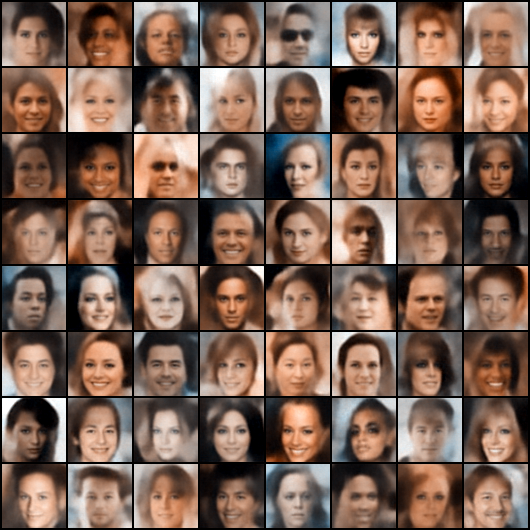

### Plot Learning Curve
```
python plot_learning_curve.py --loss Loss --learning-curve-csv cnn_celebA.csv
python plot_learning_curve.py --loss Reconstruction_Loss --learning-curve-csv cnn_celebA.csv
python plot_learning_curve.py --loss KL_Loss --learning-curve-csv cnn_celebA.csv
```
| Loss (Reconstruction + KL) | Reconstruction Loss | KL Loss |
|---|---|---|
|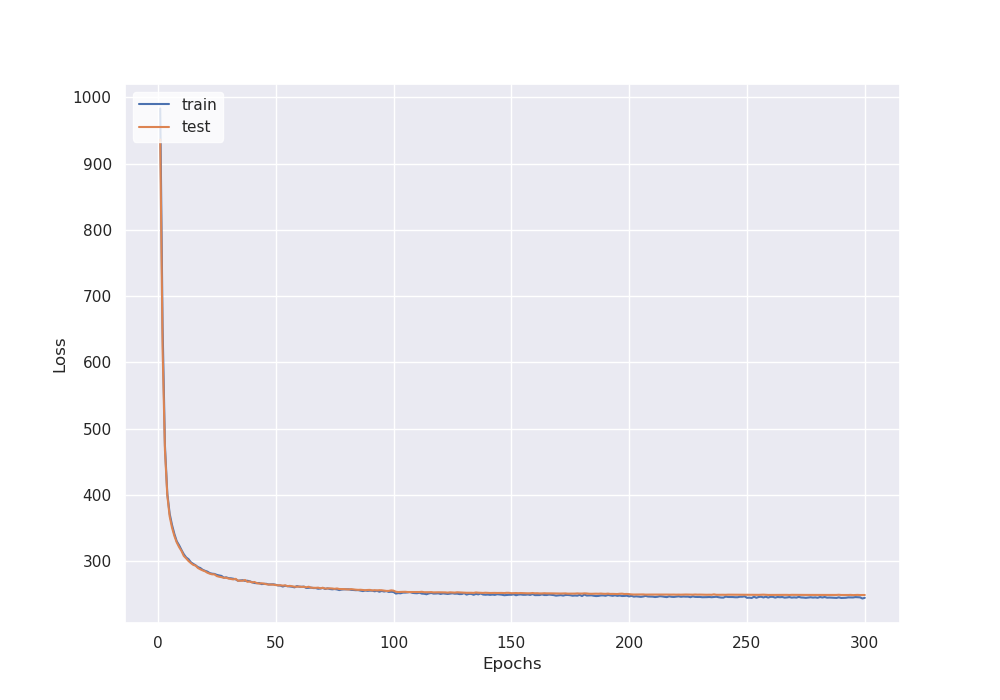   | 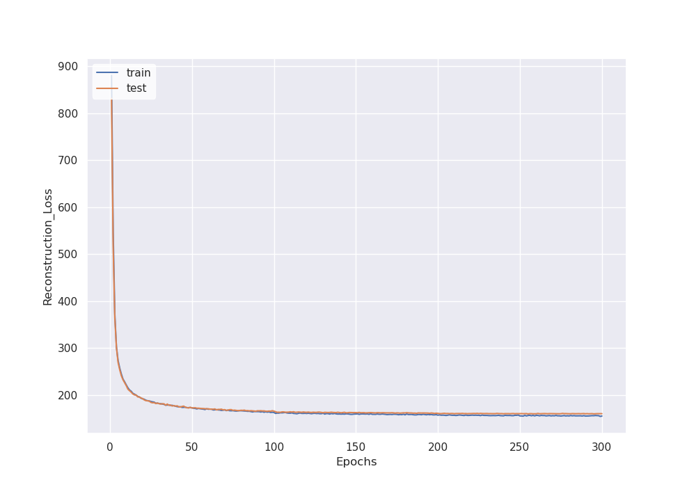  | 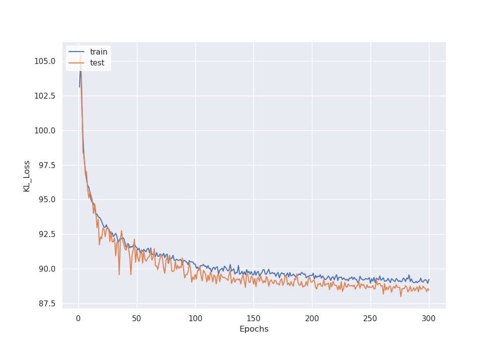  |


### Training with FC-based Model
`
python train.py --model fc --dataset celebA --num-epochs 300 --latent-dim 128
`

### Reconstruction examples
Original image on the top, reconstruction on the bottom.

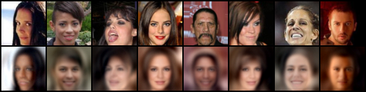

### Generate Samples
Generation (decode) from random Gaussian distribution.

`python generate_samples.py --model fc --dataset celebA --saved-path fc_celebA.pt --latent-dim 128`

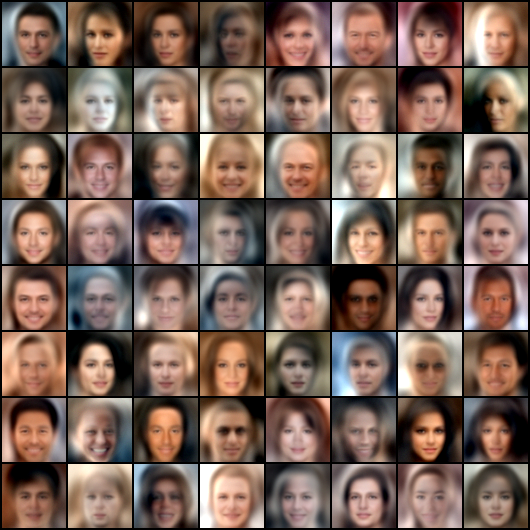

### Plot Learning Curve
```
python plot_learning_curve.py --loss Loss --learning-curve-csv fc_celebA.csv
python plot_learning_curve.py --loss Reconstruction_Loss --learning-curve-csv fc_celebA.csv
python plot_learning_curve.py --loss KL_Loss --learning-curve-csv fc_celebA.csv
```
| Loss (Reconstruction + KL) | Reconstruction Loss | KL Loss |
|---|---|---|
|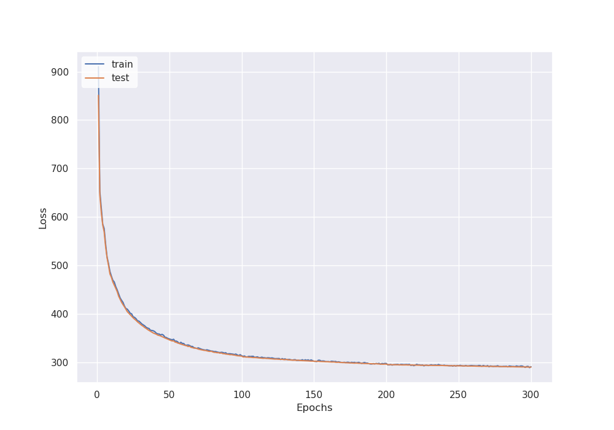   | 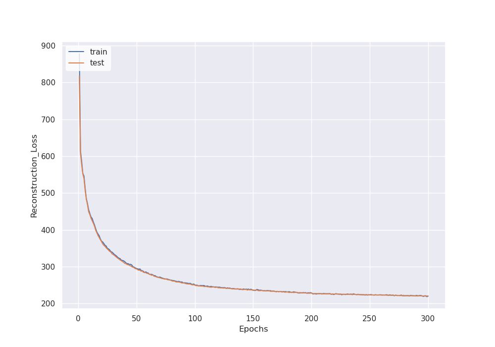  | 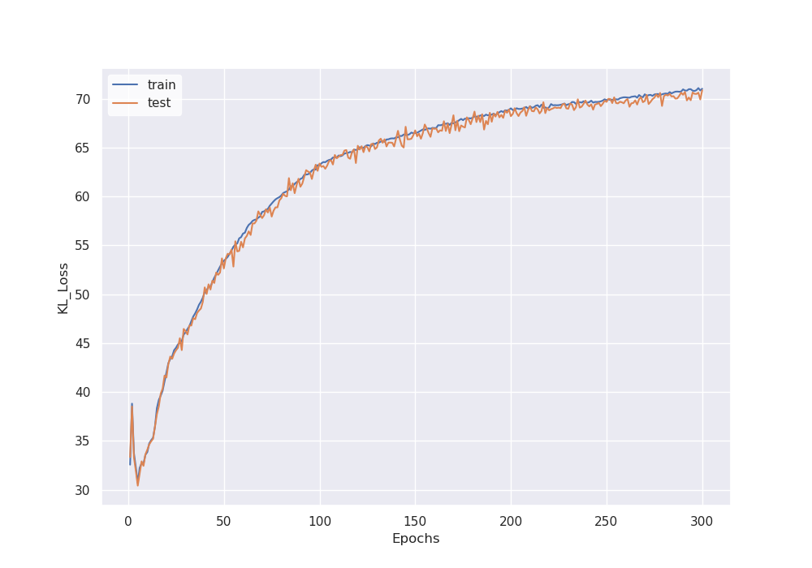  |


## MNIST Dataset

### Training with CNN-based Model
`
python train.py --model cnn --dataset mnist --num-epochs 1000 --latent-dim 16
`

### Reconstruction examples
Original image on the top, reconstruction on the bottom.

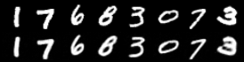

### Generate Samples
Generation (decode) from random Gaussian distribution.

`python generate_samples.py --model cnn --dataset mnist --saved-path cnn_mnist.pt --latent-dim 16`

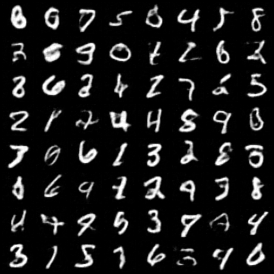

### Plot Learning Curve
```
python plot_learning_curve.py --loss Loss --learning-curve-csv cnn_mnist.csv
python plot_learning_curve.py --loss Reconstruction_Loss --learning-curve-csv cnn_mnist.csv
python plot_learning_curve.py --loss KL_Loss --learning-curve-csv cnn_mnist.csv
```
| Loss (Reconstruction + KL) | Reconstruction Loss | KL Loss |
|---|---|---|
|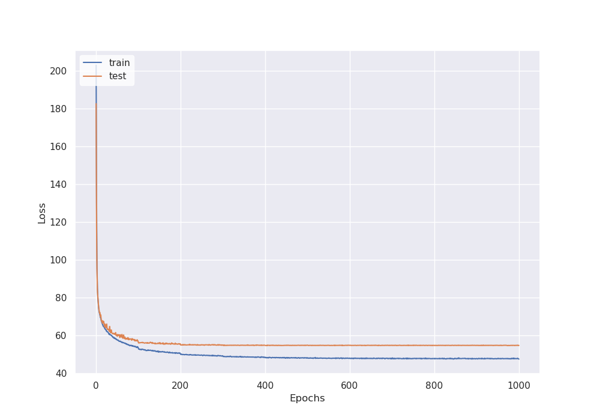   | 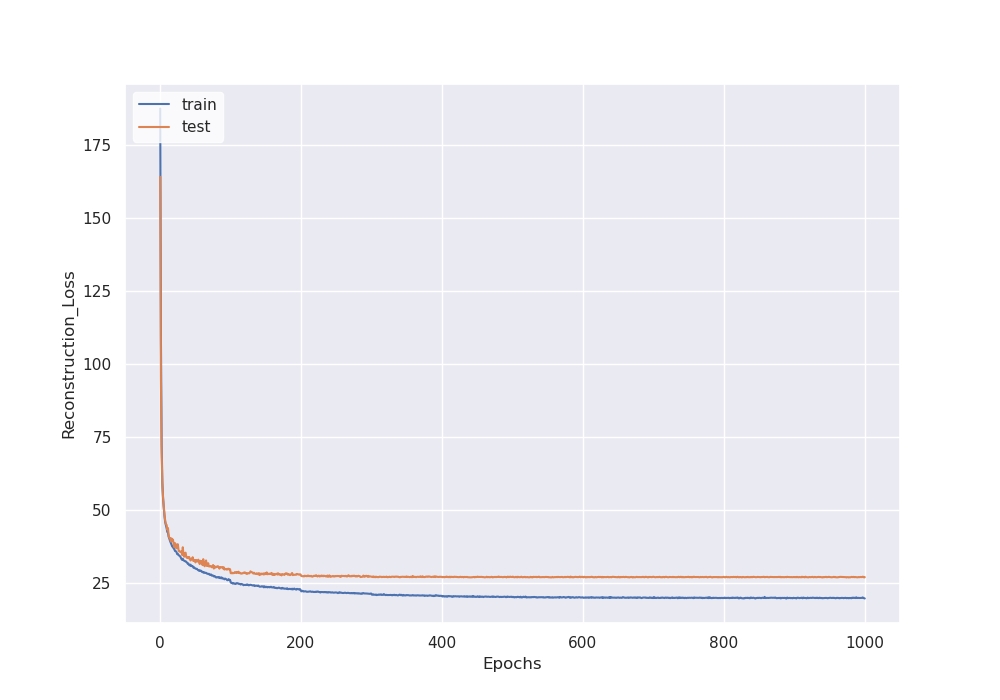  | 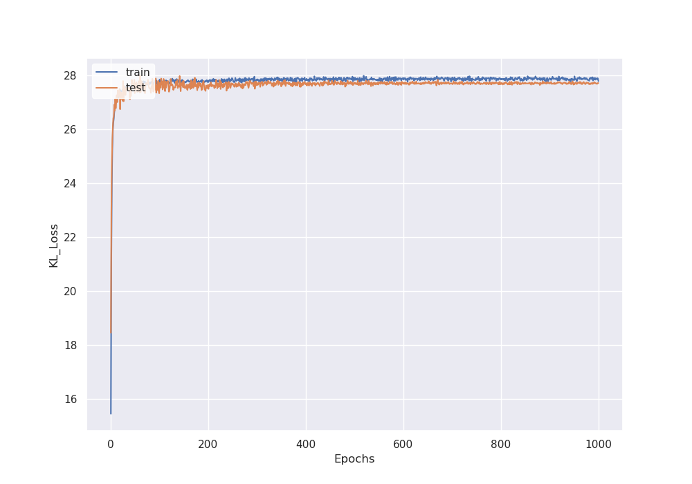  |

### Plot Latent Space
Using t-SNE, maps 16 dimensional latent space to 2D.

`python plot_latent_space.py --saved-path cnn_mnist.pt --latent-dim 16 --dataset mnist --model cnn`

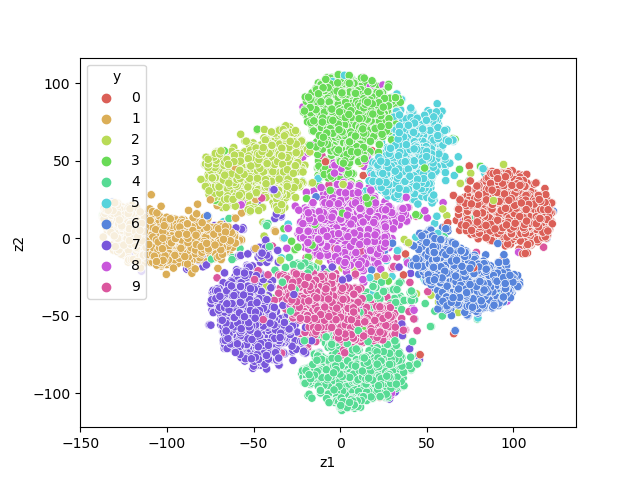

## References
### Papers
- [Auto-Encoding Variational Bayes](https://arxiv.org/abs/1312.6114)
- [An Introduction to Variational Autoencoders](https://arxiv.org/abs/1906.02691)
- [Tutorial on Variational Autoencoders](https://arxiv.org/abs/1606.05908)

### Dataset
- [Large-scale CelebFaces Attributes (CelebA) Dataset](https://mmlab.ie.cuhk.edu.hk/projects/CelebA.html)
- [THE MNIST DATABASE of handwritten digits](http://yann.lecun.com/exdb/mnist/)
